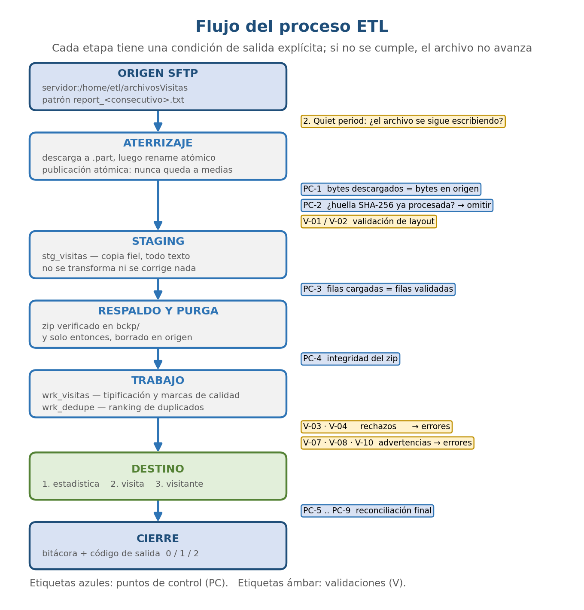
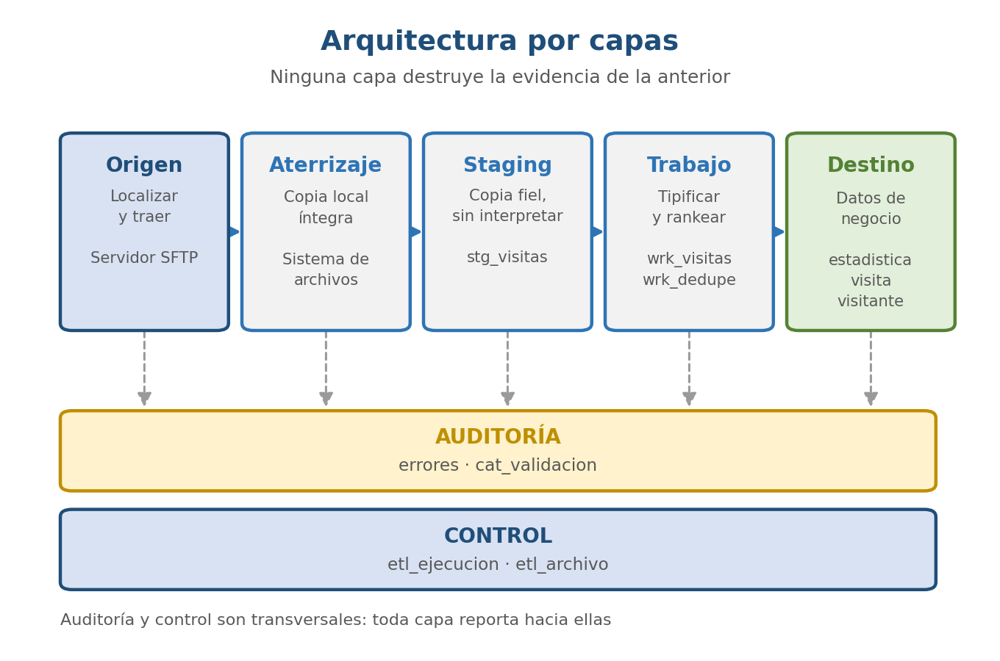
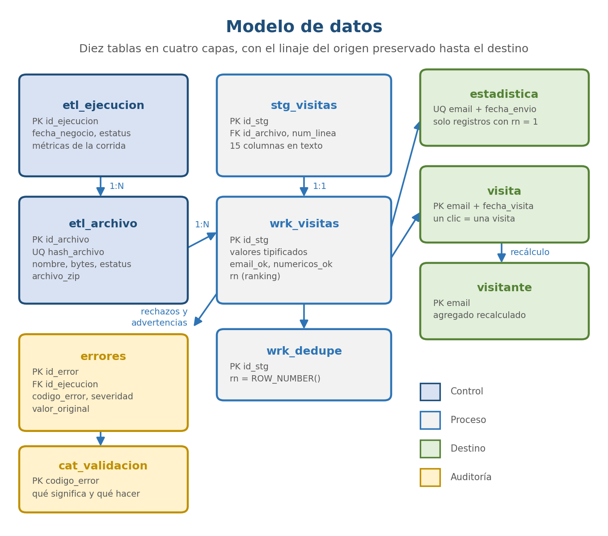

# 5 — Proceso ETL de integración de visitas web

**Stack:** Python · MySQL 8.0 · Docker · SQL

Proceso ETL que toma archivos planos de un servidor remoto, los valida, los consolida en
MySQL, los respalda y los borra del origen, dejando bitácora para el reporte mensual.

A diferencia de los otros casos del portafolio, este no es un análisis: es un sistema que
corre. El código está aquí, se levanta con Docker y se ejercita de punta a punta.

> **Aviso:** los datos son **sintéticos**, generados con `python/generar_datos.py`. El
> proyecto nació de un juego de datos con correos personales, direcciones IP y el registro
> de actividad de unas dos mil personas; nada de eso se publica. El generador reproduce el
> layout y las trampas del original para que el proceso se pueda ejercitar completo sin un
> solo dato real.

---

## El hallazgo que justifica todo lo demás

En una corrida temprana el proceso reportó 1,928 registros cargados en vez de 2,001.

No lo detectó ninguna validación de contenido. Los 73 registros faltantes tenían email
válido y fechas bien formadas: eran perfectamente correctos. Lo detectó el punto de control
de reconciliación, que no mira los datos sino que compara cuántos entraron contra cuántos
salieron.

La causa era una combinación de dos cosas inocentes por separado. Los archivos venían con
saltos de línea CRLF, y algunos campos traían listas de varias direcciones IP, legítimamente
entrecomilladas porque llevan comas dentro. El retorno de carro quedaba después de la
comilla de cierre, MySQL perdía el rastro del `OPTIONALLY ENCLOSED BY` y se comía las filas
siguientes.

Sin ese punto de control, el proceso habría terminado en éxito con el 3.6% de los datos
faltando y nadie se habría enterado nunca.

Es la razón por la que este proyecto separa validaciones de puntos de control. Una
validación revisa si un dato sirve. Un punto de control revisa si el proceso hizo lo que
dijo que hizo. Hacen falta las dos, y la segunda es la que se suele omitir.



---

## Arquitectura

Cinco capas en el flujo principal, más auditoría y control como capas transversales. La
regla que las gobierna: ninguna capa destruye la evidencia de la anterior. Desde cualquier
registro consolidado se puede reconstruir el camino hasta la línea exacta del archivo que
lo originó.



**Staging no transforma nada.** Guarda el valor como llegó. Convertir tipos durante la
carga ahorra una capa entera, pero cuando un valor no se puede convertir alguien va a
preguntar qué traía el archivo. Si staging ya normalizó, esa evidencia desapareció y la
tabla de errores solo alcanza a decir que algo falló.

**Idempotencia por huella SHA-256 del contenido**, no por nombre de archivo. Un archivo
corregido y reenviado con el mismo nombre debe poder procesarse; el mismo archivo mandado
dos veces, no.

**Respaldar antes de purgar.** Borrar en el origen es lo único que no se puede deshacer. El
orden es cargar, cuadrar el conteo, comprimir, verificar el zip, y solo entonces borrar. Si
algo revienta entre el borrado y el respaldo, desaparece el único ejemplar del dato.

---

## La decisión de diseño con más consecuencias

El requerimiento pedía integrar "visitas de un sitio web", pero los archivos traen
interacciones con campañas de correo: envíos, aperturas y clics. Antes de escribir una sola
regla hay que decidir cuál de esos eventos cuenta como visita.

El envío no cuenta: el correo sale del servidor y ahí termina. La apertura tampoco, y esta
es la que engaña, porque lo que dispara es un pixel de seguimiento que vive en el servidor
de correo. Queda el clic en el enlace, que es el único evento del archivo que efectivamente
lleva a alguien al sitio.

De ahí sale el grano de la tabla `visita`: una fila por clic, con la fecha del clic.



### Cada tabla deduplica en su propio grano

Aquí está el caso que obliga a la separación. Una misma persona aparece en dos archivos con
la misma fecha de envío, pero con clics en instantes distintos: 11:42 con dos clics, 11:43
con uno.

Por el grano del envío es un duplicado y uno de los dos se descarta. Por el grano de la
visita son dos momentos en que esa persona llegó al sitio, con un minuto de diferencia. La
explicación es de todos los días: dio clic, se le cerró el navegador o se distrajo, volvió
al correo y dio clic otra vez.

Por eso `visita` no hereda el ranking de deduplicación de `estadistica`. Su llave
`(email, fecha_visita)` deduplica en su propio grano: si las fechas de clic difieren entran
las dos visitas, y si coinciden, el origen mandó el mismo evento dos veces y la llave lo
colapsa.

**Dónde queda ciego el diseño:** la llave solo protege si el origen repite el instante
exacto. Un proveedor que redondeara el mismo clic a minutos distintos en dos reportes
produciría una visita de más, y ningún control la vería pasar. Queda declarado.

---

## Duplicados

La intuición inicial es que el par email más fecha de envío identifica un evento único. Los
datos la desmienten: hay direcciones que aparecen dos veces con la misma fecha de envío y
los registros son materialmente distintos, con diferencias en aperturas, clics, marcas de
tiempo y metadatos de IP y navegador.

Sirve para agrupar candidatos en un análisis. Como llave técnica, no. La identidad técnica
va por separado: archivo de origen más número de línea física.

**No se borra ningún repetido.** Se selecciona un representante con un criterio
determinista y los demás quedan en la tabla de errores como advertencia, con una copia
textual del registro descartado y su ubicación exacta. Abres el archivo en esa línea y ahí
está.

---

## Cómo correrlo

```bash
# 0. Dependencias
pip install -r requirements.txt

# 1. Generar los datos sintéticos
python3 python/generar_datos.py

# 2. Poner los archivos en el origen (el ETL purga data/source por diseño)
./restaurar.sh

# 3. Levantar la base
docker compose up -d

# 4. Crear el esquema
docker exec -i etl_visitas_mysql mysql -uetl -petl etl_visitas < sql/01_ddl.sql

# 5. Ejecutar
python3 python/etl_visitas.py

# 6. Pruebas de la transformación
docker exec -i etl_visitas_mysql mysql -uetl -petl --default-character-set=utf8mb4 \
  etl_visitas -t < sql/03_pruebas.sql
```

Para repetir desde cero hay que reiniciar la base **antes** de restaurar el origen. Si no,
el control de idempotencia reconoce las huellas de la corrida anterior, se salta los
archivos y el proceso termina en OK habiendo procesado cero registros:

```bash
docker exec -i etl_visitas_mysql mysql -uetl -petl etl_visitas < sql/00_reset.sql
./restaurar.sh && python3 python/etl_visitas.py
```

Sin levantar nada, esto verifica las invariantes de la transformación con Python a secas:

```bash
python3 python/analisis/12_verificar_cifras.py
```

---

## Estructura

```
├── docker-compose.yml            MySQL 8.0
├── restaurar.sh                  restaura el origen para corridas repetibles
├── python/
│   ├── etl_visitas.py            orquestador: flujo completo
│   ├── origen.py                 capa de origen conmutable (local | sftp)
│   ├── generar_datos.py          generador de datos sintéticos
│   └── analisis/                 análisis exploratorio previo, con su README
├── sql/
│   ├── 00_reset.sql              reinicio controlado
│   ├── 01_ddl.sql                esquema y catálogo de validaciones
│   ├── 02_transformacion.sql     tipificación, ranking, auditoría y cargas
│   ├── 03_pruebas.sql            pruebas de la transformación
│   ├── 04_vistas_powerbi.sql     vistas de consumo para BI
│   └── 05_reconciliacion.sql     puntos de control, versión SQL
└── documentation/
    ├── figuras/                  diagramas en SVG y PNG
    └── business_rules_matrix.md
```

`python/analisis/` guarda los scripts del análisis exploratorio, cada uno con la pregunta
que respondía y lo que encontró. El más consecuente fue el que probó que
`email + fecha_envio` no sirve como llave: sin él, habría deduplicado por ese par y borrado
registros con información real de forma irreversible.

---

## Configuración

Todo por variables de entorno. No hay rutas ni credenciales en el código.

| Variable | Por omisión | Propósito |
|---|---|---|
| `ETL_ORIGEN` | `local` | Selecciona el origen: `local` o `sftp` |
| `ETL_ORIGEN_DIR` | `data/source` | Directorio del origen en modo local |
| `ETL_SFTP_HOST` | — | Servidor remoto |
| `ETL_SFTP_DIR` | `/home/etl/archivosVisitas` | Directorio remoto |
| `ETL_SFTP_LLAVE` | — | Ruta a llave privada; preferido sobre contraseña |
| `ETL_BACKUP_DIR` | `data/backup` | Respaldos zip |
| `ETL_DB_HOST` y afines | contenedor local | Conexión a la base |

El modo local existe para ejercitar el flujo completo, borrado en origen incluido, sin un
servidor SFTP enfrente. El resto del proceso no sabe de dónde vienen los archivos.

---

## Pendientes conocidos

- Preguntar al proveedor si los reportes son incrementales o acumulativos. La llave
  `(email, fecha_visita)` colapsa un clic repetido solo si el instante coincide.
- Pedir el detalle clic por clic: hoy los N clics de un correo comparten una sola fecha.
- Pruebas automatizadas de los escenarios de fallo: layout inválido, archivo truncado,
  origen inaccesible, corte a media carga. Hoy están probadas la carga completa, la
  idempotencia y la concurrencia.
- Automatizar la política de retención de respaldos.
